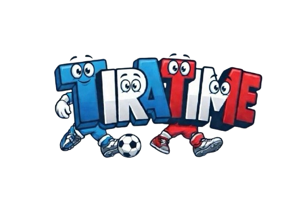

<h1>tira-time</h1>

Trabalho de Engenharia de Software. Membros da equipe: 
- Márcia Bigão Drummond - Fullstack
- Rodrigo Pierre Fernandes Felizardo - Fullstack
- João Pedro Viana Araldi - Fullstack

Objetivos do trabalho:
O objetivo deste projeto é desenvolver uma aplicação que automatize o balanceamento de times em eventos esportivos amadores, facilitando a gestão para o organizador. Através do cadastro de atletas com critérios de posição e nível de habilidade, o sistema permite selecionar os participantes de cada partida e definir o tamanho das equipes. A ferramenta processa esses dados para gerar confrontos equilibrados, garantindo competitividade e uma melhor experiência para todos os jogadores.

Tecnologias:
- React
- Tailwind
- JavaScript
- Node.js
- SQLite
- Prisma

Histórias de usuário: 
- UH 1: Como usuário, quero ser capaz de criar um jogador, atribuindo a ele um nome, uma nota para suas habilidades, e sua posição no jogo, para poder adicioná-los a diferntes partidas. 
- UH 2: Como usuário, quero ser capaz de atualizar um jogador e seus atributos, para poder registrar evolução de suas habilidades e trocas de posição. 
- UH 3: Como usuário, quero ser capaz de excluir um jogador, para que ele não possa ser adicionado em futuras partidas. 
- UH 4: Como usuário, quero ser capaz de visualizar um jogador, para poder conferir suas informações. 
- UH 5: Como usuário, quero ser capaz de sortear os times de uma determinada partida, de forma a equilibrar o nível de habilidade entre eles.
- UH 6: Como usuário, quero ser capaz de visualizar uma partida após o sorteio, em uma página contendo informações como o nome da partida e os times sorteados, de forma a conferir as informações e o resultado do sorteio. 
- UH 7: Como usuário, quero ser capaz de baixar um pdf contendo os times sorteados, para que eu possa compartilhar com os demais participantes do jogo. 

Para rodar, na raiz do projeto:

```bash
npm install
npm run setup
npm run dev
```